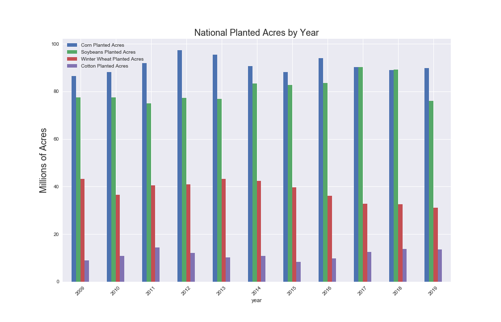

# State Of Agriculture
Agriculture has such broad economic, technological, and political implications.  President Lincoln not only established the Department of Agriculture in 1862, he referred to it as the “people’s department”.  It is precisely the people that represent this sector that this study will focus.  The scope of the analysis is focusing on five row-crops (corn, wheat, soybeans, cotton, and hay) given that they account for roughly 90 percent of harvest acreage in the US.  Along with this analysis I will be utilizing a linear regression and random forest models to try to predict end-of-year planted acres for the row crop commodities.    
<p align="center">
  
</p> 

## Table of Contents

* [Study Approach](#approach)
* [Exploratory Data Aanalysis (EDA)](#eda)
* [Data Sources](#data-sources)
* [Machine Learning Models](#ml-models)
* [Technologies](#technologies)
    * [Database](#database)
    * [Python](#python)
    * [Visualization](#visualization)
* [Conclusion](#conclusion)

  
## Approach:
The approach will be to gather datasets regarding row crop planted, harvested, and production numbers.  The model will incorporate location at the county level for each state with production.  Through the linear model I will try to find which commodities are more correlated given the mutual exclusivity of farming (if you plan corn this year you did not plant cotton).  

## Data Sources:
The main data source I will be using will be from the National Agricultural Statistics Service.  https://www.nass.usda.gov/.   They have all data required for the project, though it will require multiple methods of incorporating such information.  

## EDA:
<p align="center">
  
</p>  

Predicting future planted acres by USDA-NASS was divided into multiple steps.  One was by summing all state level numbers to get the national total, the other was by summing all county numbers to get the national total.  Through EDA; however, it was found that those two methods do not equal each other, even though they should. 

<p align="center">
  
</p> 

## ML-models:
Two models were used for this analysis.  Linear Regression and Random Forest Regressor.
Results:

Linear Model R2: 0.988<br>
RFR Model R2: 0.986

The train test split was done by years:<br>
X_train data was from 2009 to 2015<br>
y_train data was from 2010 to 2016 <br>
X_test was the year 2016<br>
y_test was the year 2017

Though a random forest model, be that a classifier or regressor can be a great starting point if the data is not known to be linear. It will be beaten out by a linear model for linear relational data. In this process I applied multiple hyper-parameter tuning for the random forest regressor, but given that the linear model out performs it, it is best to continue to use a linear model to predict future planted acres.

## Technologies
<p align="center">
  
</p>

###### Database:
Data Storage: PostgresSQL<br>
Other: Docker 

###### Python:
Data Analysis: Python 3, Numpy, Pandas, Matplotlib, SqlAlchemy, Scikit-Learn<br>

## Conclusion:
Being able to predict planted acres is the first step at ultimately predicting production of any commodity.  This model can be improved by incorporating current year data.  NASS provides multiple estimates throughout the growing season of how production is fluctuating.  This model does not take into account any current year data, only previous years to predict the following year.  By combining the March Ag numbers to the model, an even better end-of-year number can be achieved.  Feel free to clone this repo and try other models yourself, all my code is under the ```notebooks``` folder in the ```commodity_eda.ipynb``` file.  Any questions regarding this or any other project on my github can be addressed to tomas.resendiz@icloud.com. 
